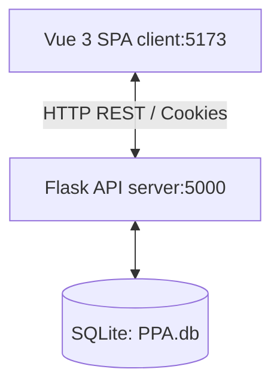
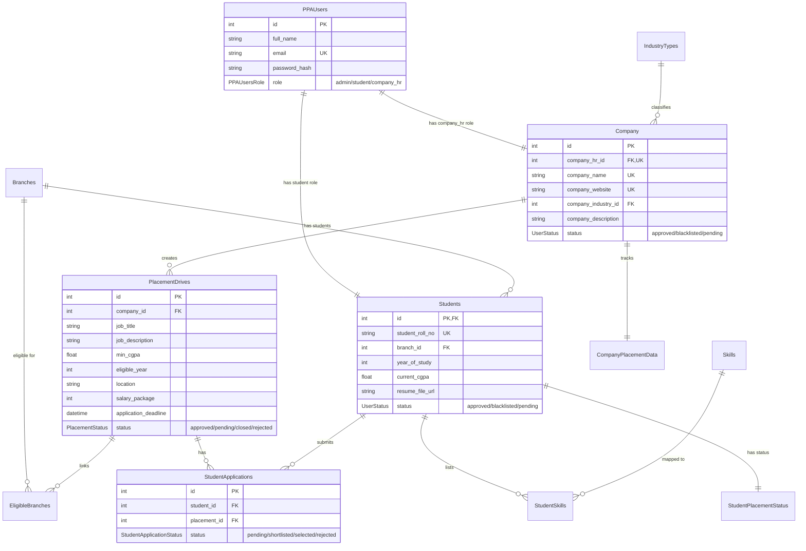

# Project Context and Architecture Documentation

This document provides a comprehensive overview of the **Placement Portal** project, covering its architecture, component breakdown, communication flows, database design, and key system observations.

---

## 1. Overall System Architecture

The project is structured as a full-stack monorepo featuring a decoupled client-server architecture:



- **Frontend (`/frontend`)**: A Single Page Application (SPA) built using **Vue 3** (Composition API, `<script setup>`), **Vite** as the build tool, and **Bootstrap 5** for UI styling.
- **Backend (`/backend`)**: A RESTful Web API built on **Flask** and **Flask-RESTful**, using **Flask-SQLAlchemy** (with SQLAlchemy 2.0 styled declarative mapping) and an **SQLite** database.
- **Integration**: The frontend communicates with the backend via asynchronous HTTP requests (`fetch` API). Authentication is handled securely using cookie-based JSON Web Tokens (JWT).

---

## 2. Backend Architecture (`/backend`)

The backend is located in the `backend/` directory and utilizes the Flask Application Factory pattern.

### Directory Structure & Roles
- **`run.py`**: Entry point that runs the development server with debugging enabled.
- **`models_setup.py`**: Initial database setup and seeding script. It creates all database tables and seeds:
  - An Admin user (`admin@ppa.com` with password `admin123`).
  - Prepopulated lists of college departments (Branches) and industry sectors.
- **`ppa/`**: Main package folder.
  - **`__init__.py`**: Configures the Flask application, database connection, JWT settings, CORS policy (specifically enabling localhost dev ports 5173/5174/5175 with credentials support), and registers blueprints.
  - **`extensions.py`**: Instantiates Flask extensions (`SQLAlchemy` declarative base and `Bcrypt` hashing instance) to avoid circular imports.
  - **`models.py`**: Defines the SQLite ORM schemas.
  - **`ApiDesign.md`**: Developer notes documenting the proposed endpoints and caching suggestions.
  - **`routes/`**: Handles the API endpoints.
    - **`__init__.py`**: Instantiates `flask_restful.Api`, registers resources, and maps endpoints.
    - **`check_rbac.py`**: Contains the Role-Based Access Control decorator (`check_jwt_and_role`).
    - **`identity_routes.py`**: Validates user credentials, role, and active status.
    - **`auth_routes.py`**: Manages registration (signup), login, and session clearance (logout).
    - **`admin_routes.py`**: Admin dashboards, approval systems, and user profile management.

### Database Design & Schema (`ppa/models.py`)

The database consists of structured tables utilizing String-based Enums (`StrEnum`) for type-safety:



### Authentication & RBAC Flow
1. **JWT in HTTP-Only Cookies**: Authentication details are stored in an HTTP-Only, Secure cookie named `token`. This mitigates Cross-Site Scripting (XSS) risks. CSRF checks are set up but disabled in this local environment (`JWT_COOKIE_CSRF_PROTECT=False`).
2. **Access Lifespan**: Tokens have a 10-minute expiration limit.
3. **Role-Based Protection**: The custom `@check_jwt_and_role` decorator intercepts incoming API calls:
   - Validates the token's signature.
   - Extracts the role and database ID (`sub`).
   - Checks the database to see if a student or company is **pending approval** or **blacklisted**. If so, it blocks access immediately and returns a `403 Forbidden` status.
   - Allows requests to proceed if the user is an `admin` or their role matches the requirements of the endpoint.
4. **Strict `user_id` Match Checks**: For non-admin roles, GET requests must expect `user_id` in the query parameters (`request.args`), and POST/PATCH/PUT requests must expect `user_id` inside the JSON body as the key `"user_id"`. The decorator validates that this matches the authenticated identity (`sub` claim) inside the JWT token. Future student and company endpoints must require this argument in their JSON payload/query params to restrict data retrieval.

---

## 3. Frontend Architecture (`/frontend`)

The frontend is built using a Single Page Application (SPA) architecture in Vue 3.

### Directory Structure & Roles
- **`package.json`**: Lists client dependencies (`vue`, `vue-router`, `bootstrap`).
- **`vite.config.js`**: Resolves `@` to point to `./src` for clean import paths.
- **`src/main.js`**: Mounts the Vue app, loads global styles (`style.css`, Bootstrap), and registers the routing table.
- **`src/App.vue`**: Main entry viewport rendering the routed components using `<router-view>`.
- **`src/router.js`**: Dictates navigation mapping:
  - `/` & `/login` $\rightarrow$ `Login.vue`
  - `/signup/:category?` $\rightarrow$ `Signup.vue` (dynamically loads student or company forms)
  - `/pending` $\rightarrow$ `Pending.vue` (waiting area for unapproved HRs/Students)
  - `/blacklisted` $\rightarrow$ `Blacklisted.vue` (access revoked page)
  - `/admin/:page?` $\rightarrow$ `Admin.vue` (admin dashboard and inner views)
  - `/company_hr/:page?` $\rightarrow$ `Company.vue` (employer console)
  - `/Error/:status?/:message?` $\rightarrow$ `Error.vue` (general API fallback page)
- **`src/globalStateStore.js`**: Custom reactive state module tracking user session data.
- **`src/hooks/useCheckIdentity.js`**: Custom hook running on layout components. It fetches `/api/identity` with credentials (`include` mode for cookies) to automatically route users to their appropriate dashboards.
- **`src/pages/`**: Major view wrappers (like `Admin.vue`, `Company.vue`, `Login.vue`).
- **`src/components/`**: Modular sub-sections of the user interfaces:
  - **`auth/`**: Forms for student and company registrations.
  - **`admin/`**: Navigation sidebar (`AdminNavbar.vue`), dashboard controls (`AdminDashboard.vue`), drive inspection boards (`AdminPlacementDriveView.vue`), and student/company profile cards (`AdminStudentView.vue`, `AdminCompanyHRView.vue`).
  - **`company/`**: Dashboard navigation controls for employers.

---

## 4. Key Architectural Observations & System Issues

Several architectural quirks and design limitations were observed in the current implementation:

### 1. Missing Student Dashboard Path
- **Observation**: There is no router path configured in `src/router.js` to serve a Student Dashboard (such as `/student`).
- **Impact**: When a student signs up successfully (`StudentSignup.vue` line 33) or is authenticated (`useCheckIdentity.js` line 20), the client application attempts to route them to `/student`, which is undefined and results in route mismatches or redirection loops.

### 2. State Store Syntax Bug
- **Observation**: The state manager located in `src/globalStateStore.js` (lines 11–14) contains a syntax issue:
  ```javascript
  export const globalStateStore = () => {
      currentUser: readonly(currentUser),
      setCurrentUser
  }
  ```
- **Impact**: The arrow function is wrapped in block brackets but lacks a `return` statement. Additionally, it uses comma separators instead of semicolon statements inside a standard function block. As a result, calling `globalStateStore()` will return `undefined` rather than the intended state interface.

### 3. Student Account Approvals
- **Observation**: The database model defines the default signup status for Students as `approved` (`UserStatus.APPROVED_ROLE` in `models.py` line 58) and Companies as `pending` (`UserStatus.PENDING_ROLE` in line 91).
- **Impact**: Students gain immediate access to the portal upon registration, while Company HR accounts require manual verification by college administrators before they can access dashboard features.

### 4. Bypassed Middleware Validation
- **Observation**: The project bypasses robust validation tools (like Pydantic in the backend or Pinia stores in the frontend) to ensure compatibility with automatic test grading platforms (as outlined in the root `README.md`). Instead, input parsing is managed through simple client-side checks and basic Flask-RESTful `reqparse` modules.
